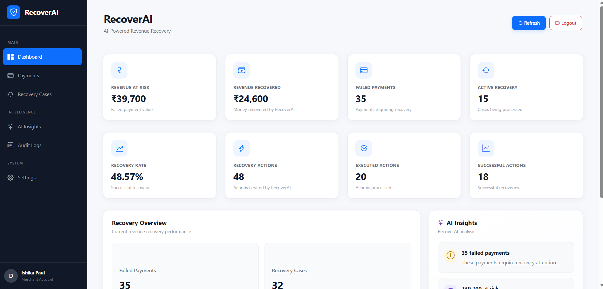
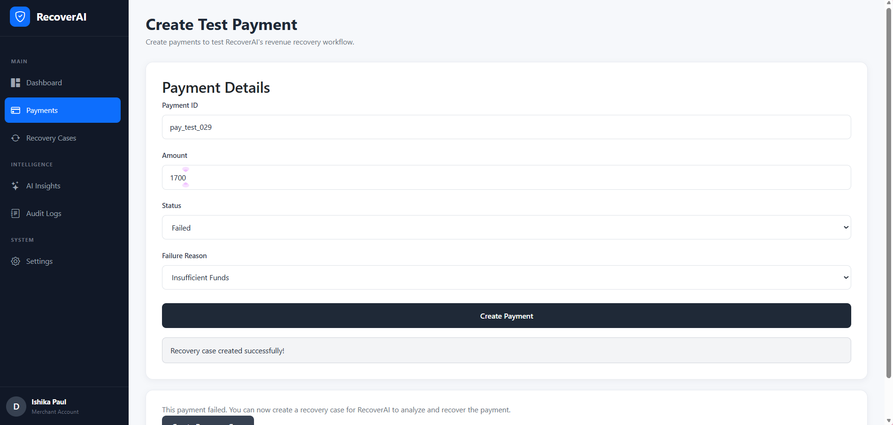
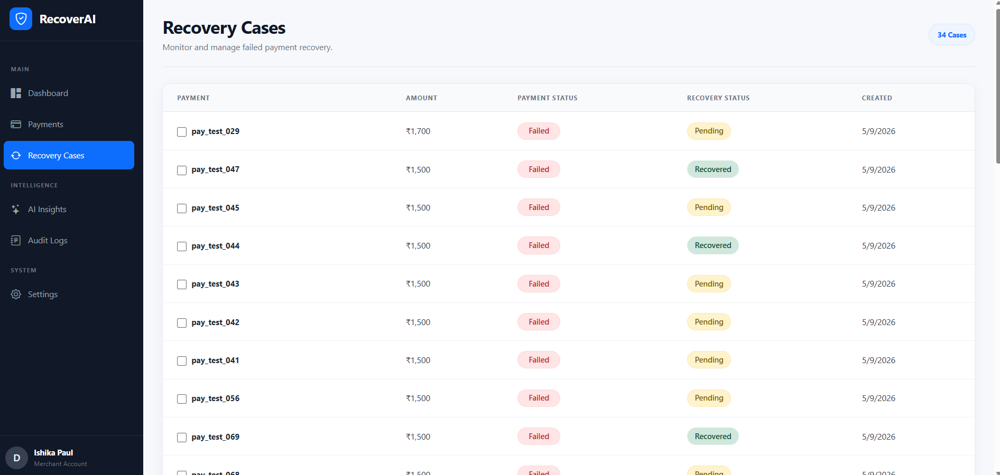
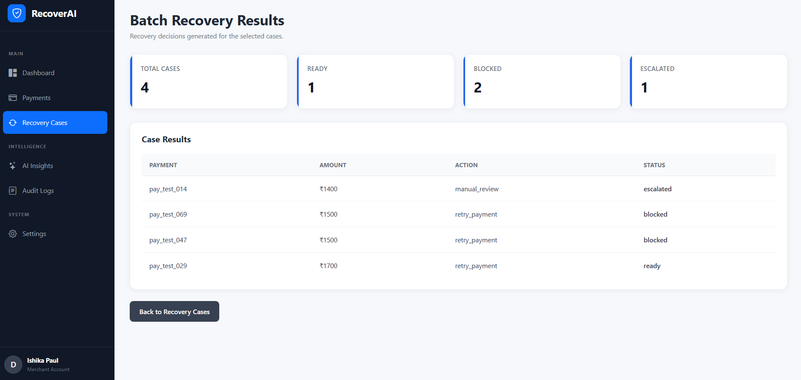
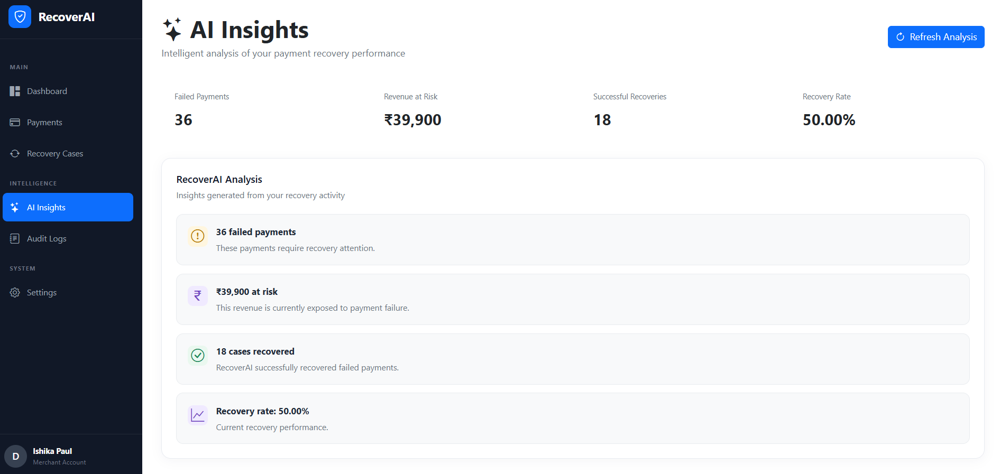
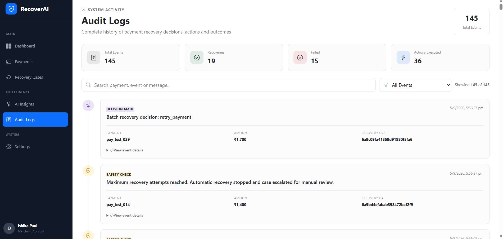
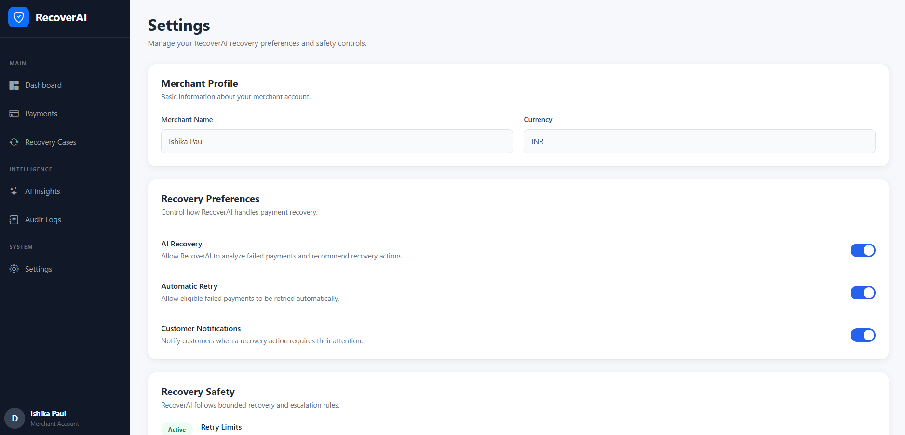

# RecoverAI

### AI-Powered Revenue Recovery

RecoverAI is an AI-powered revenue recovery agent that detects failed payments, analyzes the reason for payment failure, selects policy-bounded recovery actions, and measures recovered revenue with a complete audit trail.

## Problem Statement

Failed payments create a direct risk of revenue loss for businesses. When a payment fails, merchants need to quickly understand why it failed and decide what recovery action should be taken.

Manual recovery processes can be slow, inconsistent, and difficult to scale. At the same time, blindly retrying payments or repeatedly contacting customers can create poor customer experiences and unnecessary risk.

RecoverAI addresses this problem by automating the revenue recovery workflow while keeping recovery actions policy-bounded, traceable, and measurable.

## Buildathon Track

**Razorpay AI Buildathon 2026 — Track 03: AI Revenue Recovery**

RecoverAI is built to identify revenue at risk, determine the appropriate recovery intervention, execute bounded recovery workflows, and measure recovered revenue across individual and batch recovery cases.

## Solution

RecoverAI provides an automated revenue recovery workflow for failed payments.

The system analyzes each failed payment, identifies the likely failure category, recommends an appropriate recovery action, and executes only actions that pass predefined recovery policies.

The workflow is designed as a bounded recovery loop:

**Detect → Diagnose → Decide → Safety Check → Execute → Measure → Audit**

This allows merchants to recover revenue systematically while preventing unsafe or repeated recovery attempts.

## Key Features

* **Revenue at Risk Detection** — Identifies failed payments and calculates the revenue currently at risk.
* **Failure Diagnosis** — Analyzes failed payments and categorizes the likely failure reason.
* **Recovery Decision Engine** — Selects an appropriate recovery action based on the failure category and recovery rules.
* **Policy-Bounded Recovery** — Prevents unsupported or unsafe recovery actions through predefined policies.
* **Batch Recovery** — Processes multiple recovery cases together and generates recovery decisions for each case.
* **Stopping Rules** — Automatically stops repeated recovery attempts and escalates cases for manual review when the retry limit is reached.
* **Recovery Execution** — Executes supported recovery actions such as payment retries, payment links, customer notifications, and payment-method changes.
* **Revenue Measurement** — Tracks the actual amount recovered after successful recovery outcomes.
* **Audit Trail** — Records important recovery events including decisions, safety checks, action execution, and recovery completion.
* **Recovery Dashboard** — Provides real-time visibility into revenue at risk, revenue recovered, recovery cases, recovery rate, and recovery actions.
* **AI Insights** — Provides automated insights based on recovery performance and payment data.

## Recovery Workflow

RecoverAI follows a bounded, step-by-step recovery workflow:

1. **Detect** — Identify failed payments and calculate revenue at risk.
2. **Diagnose** — Analyze the payment failure and classify its likely failure category.
3. **Decide** — Select the most appropriate recovery action based on the diagnosis.
4. **Safety Check** — Validate the proposed action against predefined recovery policies and stopping rules.
5. **Execute** — Execute the approved recovery action.
6. **Measure** — Record the recovery outcome and calculate the amount of revenue recovered.
7. **Audit** — Record important decisions, safety checks, executions, and recovery outcomes in the audit trail.

This workflow ensures that recovery actions are automated but remain controlled, traceable, and bounded by predefined rules.

## Architecture

RecoverAI follows a modular full-stack architecture:

```text
                    ┌──────────────────────┐
                    │   React Frontend     │
                    │   Dashboard & UI     │
                    └──────────┬───────────┘
                               │
                               │ REST API
                               ▼
                    ┌──────────────────────┐
                    │   Node.js + Express  │
                    │      Backend         │
                    └──────────┬───────────┘
                               │
              ┌────────────────┼────────────────┐
              │                │                │
              ▼                ▼                ▼
       ┌─────────────┐  ┌──────────────┐  ┌─────────────┐
       │  Recovery   │  │    Policy    │  │   Audit     │
       │   Engine    │  │    Engine    │  │    Logs     │
       └──────┬──────┘  └──────┬───────┘  └──────┬──────┘
              │                │                │
              └────────────────┼────────────────┘
                               ▼
                    ┌──────────────────────┐
                    │       MongoDB        │
                    │ Payments / Cases /   │
                    │ Actions / Audit Logs │
                    └──────────────────────┘
```

### Main Components

* **React Frontend** — Provides the merchant dashboard, recovery case management, batch recovery interface, settings, and recovery results.
* **Node.js + Express Backend** — Provides authenticated REST APIs and coordinates the recovery workflow.
* **Recovery Engine** — Analyzes failed payments and recommends recovery actions based on failure categories.
* **Policy Engine** — Validates recovery actions and enforces safety constraints.
* **Recovery Case & Action Models** — Track recovery decisions, execution status, and outcomes.
* **Audit Logging** — Records recovery decisions, safety checks, executions, and outcomes.
* **MongoDB** — Stores merchant, payment, recovery case, recovery action, and audit data.

## Tech Stack

### Frontend

* React.js
* JavaScript
* HTML5
* CSS3
* Bootstrap

### Backend

* Node.js
* Express.js
* REST APIs
* JWT Authentication

### Database

* MongoDB
* Mongoose

### Core Recovery System

* Rule-based AI recovery engine
* Policy and safety engine
* Batch recovery processing
* Recovery outcome tracking
* Audit logging

## How the Recovery Engine Works

RecoverAI uses a rule-based recovery engine to analyze failed payments and recommend an appropriate recovery action.

The engine considers the payment failure reason and maps it to a recovery category and recommended action.

| Failure Category        | Recommended Action |
| ----------------------- | ------------------ |
| Insufficient Funds      | Retry Payment      |
| Bank Declined           | Send Payment Link  |
| Network Error / Timeout | Retry Payment      |
| Authentication Failure  | Send Payment Link  |
| Unknown Failure         | Manual Review      |

The engine also generates a recovery score and confidence value for each decision.

These decisions are then passed through the policy engine before any recovery action can be executed.

## Safety & Stopping Rules

RecoverAI uses policy-based safeguards to prevent unsafe or repeated recovery actions.

### Policy Controls

* Only supported recovery actions can be executed.
* Recovery actions are validated against the payment failure category.
* Unknown payment failures are escalated to **manual review** instead of being automatically executed.
* A recovered case cannot be processed again.
* Duplicate active recovery actions are blocked.

### Stopping Rule

RecoverAI limits repeated failed recovery attempts.

When a recovery case reaches **2 failed recovery attempts**, automatic recovery is stopped and the case is escalated to manual review.

Every safety decision and escalation is recorded in the audit trail.

This ensures that the recovery agent remains bounded and does not repeatedly attempt potentially ineffective or unsafe actions.

## Batch Recovery

RecoverAI supports processing multiple recovery cases in a single batch.

For each selected recovery case, the system:

1. Analyzes the failed payment.
2. Determines the recommended recovery action.
3. Checks the action against recovery policies.
4. Blocks unsupported or duplicate actions.
5. Escalates cases that require manual review.
6. Creates approved recovery actions for execution.
7. Records the recovery decision in the audit trail.

The batch recovery interface provides a summary of the results, including:

* **Ready** — Recovery action is approved and ready for execution.
* **Blocked** — Recovery action cannot be performed because of an existing action or policy restriction.
* **Escalated** — Automatic recovery is stopped and the case requires manual review.

This allows merchants to process multiple at-risk payments efficiently while keeping every recovery decision bounded and traceable.

## Revenue Measurement

RecoverAI measures the financial impact of the recovery workflow.

For every recovery case, the system tracks:

* Payment amount
* Recovery case status
* Recovery action
* Recovery outcome
* Recovered amount

When a recovery action is successfully completed, the corresponding payment amount is recorded as recovered revenue.

The dashboard calculates and displays:

* **Revenue at Risk** — Total value of failed payments that have not yet been recovered.
* **Revenue Recovered** — Total value successfully recovered through completed recovery cases.
* **Recovery Rate** — Percentage of failed payments that have reached a recovered state.

This allows recovery performance to be measured in terms of actual monetary value rather than only the number of recovery attempts.

## Audit Trail

RecoverAI maintains an audit trail for important events throughout the recovery workflow.

The system records events such as:

* Payment failure detection
* Recovery analysis
* Recovery decision
* Safety and policy checks
* Manual escalation
* Recovery action execution
* Successful recovery
* Failed recovery

Each audit record is associated with the relevant merchant, payment, and recovery case, making the recovery process traceable from the initial failure to the final outcome.

This provides visibility into **what decision was made, why it was made, what action was executed, and what recovery outcome occurred**.


## Screenshots

### Dashboard



### Payments



### Recovery Cases



### Batch Recovery Results



### AI Insights



### Audit Logs



### Settings



## How to Run Locally

### 1. Clone the Repository

```bash
git clone https://github.com/ispl09/RecoverAI.git
cd RecoverAI
```

### 2. Setup the Backend

```bash
cd backend
npm install
```

Create a `.env` file inside the `backend` folder and add the required environment variables.

Then start the backend:

```bash
node server.js
```

### 3. Setup the Frontend

Open a new terminal:

```bash
cd frontend
npm install
npm start
```

The React application will open in the browser.

### 4. Database

RecoverAI uses MongoDB for storing merchants, payments, recovery cases, recovery actions, and audit logs.

Make sure MongoDB is configured correctly in the backend environment variables before starting the application.

## Demo Workflow

A typical RecoverAI recovery flow:

1. A payment fails and becomes a revenue-at-risk case.
2. RecoverAI analyzes the payment failure.
3. The recovery engine recommends an appropriate action.
4. The policy engine performs a safety check.
5. Approved cases are executed individually or through batch recovery.
6. Recovery outcomes are recorded.
7. Successfully recovered revenue is reflected on the dashboard.
8. All important decisions and actions are stored in the audit trail.

This demonstrates the complete recovery loop:

**Detect → Diagnose → Decide → Safety Check → Execute → Measure → Audit**

## Note

RecoverAI was built as a project for the **Razorpay AI Buildathon 2026 — Track 03: AI Revenue Recovery**.
